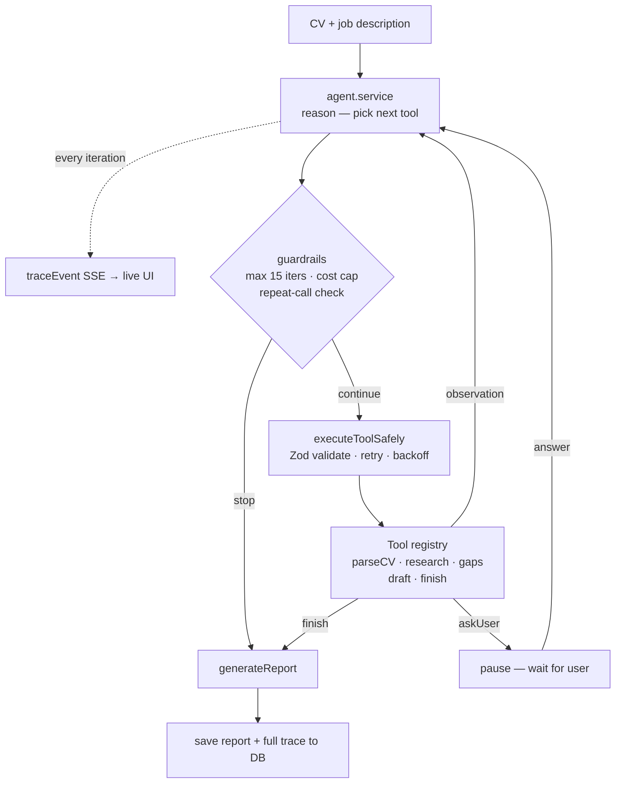
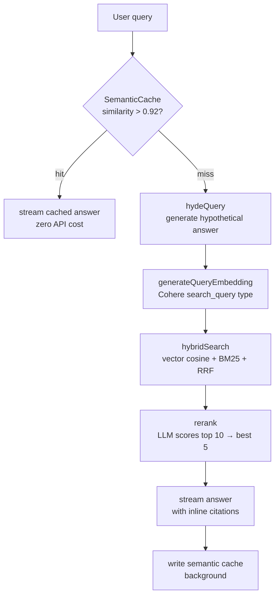

<h1 align="center">👋 Hi, I'm Joshua Kipamet</h1>

  <b>Fullstack AI Engineer</b> — self-directed builds in RAG pipelines, autonomous agents, and semantic search. 
  Targeting junior and associate roles.

  
  
  
  

---

## 🧠 What I build

Deployed AI systems — not tutorials, not wrappers. Self-directed projects with real architectural decisions, automated tests, and CI/CD pipelines.

- **RAG pipelines** — HyDE, hybrid search (vector + BM25 + RRF), re-ranking, semantic caching
- **Autonomous agents** — ReAct loops, typed tool registries, guardrails, trace logging, human-in-the-loop *(Apply-AI, in progress)*
- **Semantic search** — pgvector, Cohere embeddings, HNSW indexing, cosine similarity
- **Streaming AI** — raw SSE fetch, ReadableStream, TextDecoder, token-by-token rendering
- **Multi-tenant SaaS** — org-scoped data isolation, RBAC, per-user token quotas

---

## 🛠 Tech Stack

| Layer | Tools |
|---|---|
| **Frontend** |      |
| **Backend** |    |
| **AI & Vector** |      |
| **Database** |     |
| **DevOps** |     |

---

## 💡 Architectural Decisions

Real decisions I made and debugged — not post-hoc justifications.

| Decision | Chose | Rejected | Why |
|---|---|---|---|
| LLM inference | Groq | OpenAI | Free tier, fast inference, same API shape |
| Embeddings | Cohere embed-english-v3 | OpenAI text-embedding-3 | Free tier, no credit card, 1024-dim vectors |
| Vector store | pgvector | Pinecone | Already on PostgreSQL — no new service, no extra cost. HNSW handles current scale |
| Streaming | Raw SSE fetch | Groq SDK | SDK v1.5.0 returned `delta: {}` for reasoning model chunks — switched to raw fetch, which reads the stream directly and parses correctly |
| Chunking | Recursive | Fixed-size | Fixed-size breaks sentences mid-thought. Recursive splits on paragraphs → lines → sentences → words — preserves complete thoughts |
| Multi-tenancy | Domain-based org grouping | Invite codes | Zero friction — same email domain auto-joins the same org; public domains get isolated personal orgs |
| Auth storage (Enterprise KB, Apply-AI) | Authorization header | httpOnly cookies | Agent background workers make stateless API calls — cookies don't work in that context |

---

## 🚀 Featured Projects

### 🤖 Apply-AI — Autonomous Job Application Agent

Autonomous AI agent that researches companies, identifies skill gaps, drafts tailored cover letters, generates likely interview questions, and produces a full report — the model decides what to do next, not the code.

**Agent vs workflow — the key distinction:**

| Workflow (what tutorials build) | Agent (what I'm building) |
|---|---|
| Hardcoded step order | Model picks each next tool from a registry |
| Fixed pipeline | ReAct loop: reason → act → observe → repeat |
| No failure handling | Tool failures returned as observations — agent adapts |
| One fixed checkpoint | `askUser` can pause the loop mid-execution |
| No safety bounds | Guardrails in code: max 15 iters, cost cap, repeat-call detection |

**Pipeline:**

**Stack:** Node.js · TypeScript · PostgreSQL · Prisma · Groq · Cohere · BullMQ · WebSockets · Mastra · React · shadcn/ui

💻 [GitHub](https://github.com/joshu1024/REPLACE-WITH-APPLY-AI-REPO) · 🔗 Live demo — coming soon

---

### 🧠 Enterprise AI Knowledge Base

Multi-tenant RAG SaaS. Teams upload company documents and query them in natural language with streaming answers and inline source citations.

**Basic RAG vs this implementation:**

| Tutorial RAG | This implementation |
|---|---|
| Embed raw question | Embed a hypothetical answer (HyDE) — questions and answers live in different vector spaces |
| Vector search only | Vector + BM25 keyword, merged with Reciprocal Rank Fusion |
| Return top-k directly | LLM re-ranks top 10, returns best 5 |
| No caching | Semantic cache (>0.92 similarity) — repeated queries cost zero API calls |
| Generic retrieval | Org-scoped — `WHERE organizationId = $1` on every query |

**Pipeline:**

**51 automated tests** (19 backend + 32 frontend) run on every push via GitHub Actions CI · Render + Vercel + Neon

**Stack:** Node.js · TypeScript · PostgreSQL · pgvector · Prisma · Neon · Cohere · Groq · React · shadcn/ui · Redux Toolkit

🔗 [Live Demo](https://enterprise-ai-kb.vercel.app/) · 💻 [GitHub](https://github.com/joshu1024/Enterprise-ai-kb)
 ⚠️ Free-tier backend — the first request after idle can take up to a minute.

---

### 👟 SneakerZone — E-Commerce + AI Shopping Assistant

Deployed e-commerce platform with AI features layered on top of a real PostgreSQL database.

**AI features:**

- **Semantic search** — Cohere embeddings + pgvector. "Something for a teenager who likes running" returns relevant products by meaning, not keyword match. Retrieval-based — not the model learning or improving.
- **Tool use** — AI calls `searchProducts` or `semanticSearchProducts`, receives real Prisma query results, and streams the answer. Every tool call is scoped by the authenticated `userId` (taken from the verified JWT, not from model output), so a prompt can't change whose orders are queried.
- **Security layer** — rate limiting, prompt injection pattern detection, output moderation scan before the response reaches the user, per-user token quota with monthly reset

**Stack:** React · Node.js · Express · PostgreSQL · pgvector · Prisma · Groq · Cohere · Redux Toolkit · PayPal · Cloudinary

🔗 [Live Demo](https://sneakerzone.vercel.app/) · 💻 [GitHub](https://github.com/joshu1024/Scalable-ecommerce-platform)
 ⚠️ Free-tier backend — the first request after idle can take up to a minute.

---

### 📊 SaaS Analytics Dashboard

Role-based analytics platform — the project where I learned TypeScript by migrating a full MERN codebase.

- Migrated 10+ Redux slices, 20+ React components, 15+ API endpoints to TypeScript
- MongoDB aggregation pipelines over 50K+ records
- ~40% load time reduction with server-side pagination
- RBAC with JWT in httpOnly cookies — the token isn't readable by client-side JavaScript

**Stack:** React · TypeScript · Node.js · MongoDB · Recharts · Redux Toolkit

🔗 [Live Demo](https://dashboard-mern-tau.vercel.app/) · 💻 [GitHub](https://github.com/joshu1024/analytics-dashboard-mern)
 ⚠️ Free-tier backend — the first request after idle can take up to a minute.

---

## 🏗 Engineering Highlights

- Debugged a Groq SDK streaming failure — `delta` returned as `{}` for reasoning models. Identified the root cause (SDK v1.5.0 incompatibility), switched to raw SSE fetch, documented the fix
- Tests caught a real bug before release — document slice `pending` reducers set `loading: false` instead of `true`. Broken loading states would have shipped without them
- Migrated a live ecommerce database from MongoDB to PostgreSQL + Prisma without data loss
- Tool calls take `userId` from the verified JWT, never from model output, and it's applied in every Prisma query — a prompt injection can't change whose data is queried
- 51 automated tests on Enterprise KB (19 backend + 32 frontend), run on every push via GitHub Actions

---

## 📚 Also see

- 💡 [DSA Interview Preparation](https://github.com/joshu1024/DSA-Interview-Preparation) — active problem-solving practice alongside the AI project work

---

## 📈 Currently Building

- 🔄 Apply-AI — autonomous job application agent
- 🔜 Behavioral evals for Apply-AI (LLM-as-judge)
- 🔜 Docker — containerization for Apply-AI
- 🔜 Next.js — App Router, server components, server actions
- 🔜 LangSmith tracing, prompt versioning, and cost optimization
