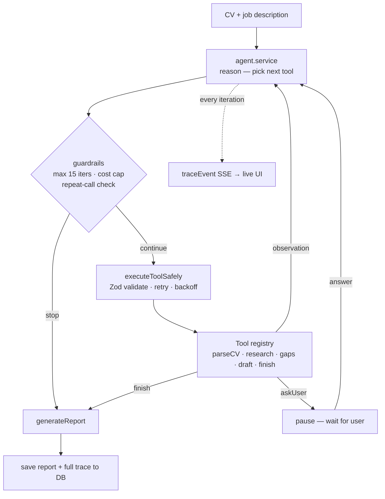
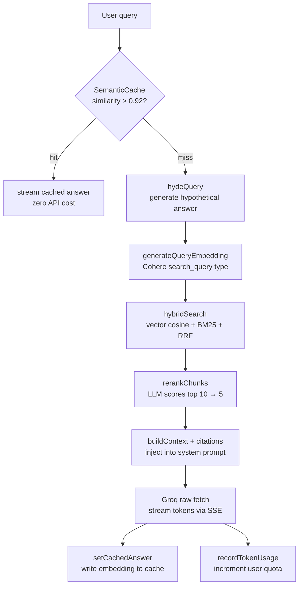

<h1 align="center">👋 Hi, I'm Joshua Kipamet</h1>

  <strong>Fullstack AI Engineer</strong> — building production RAG systems, autonomous agents, and semantic search

  
  
  
  

---

## 🧠 What I build

Production AI systems — not tutorials, not wrappers. Deployed products with real architectural decisions, automated tests, and CI/CD pipelines.

- **RAG pipelines** — HyDE, hybrid search (vector + BM25 + RRF), re-ranking, semantic caching
- **Autonomous agents** — ReAct loops, typed tool registries, guardrails, trace logging, human-in-the-loop
- **Semantic search** — pgvector, Cohere embeddings, HNSW indexing, cosine similarity
- **Streaming AI** — raw SSE fetch, ReadableStream, TextDecoder, token-by-token rendering
- **Multi-tenant SaaS** — org-scoped data isolation, RBAC, per-user token quotas

---

## 🛠 Tech Stack

<table>
<tr>
<td><strong>Frontend</strong></td>
<td>

</td>
</tr>
<tr>
<td><strong>Backend</strong></td>
<td>

</td>
</tr>
<tr>
<td><strong>AI & Vector</strong></td>
<td>

</td>
</tr>
<tr>
<td><strong>Database</strong></td>
<td>

</td>
</tr>
<tr>
<td><strong>DevOps</strong></td>
<td>

</td>
</tr>
</table>

---

## 💡 Architectural Decisions

Real decisions I made and debugged — not post-hoc justifications.

| Decision | Chose | Rejected | Why |
|----------|-------|----------|-----|
| LLM inference | Groq | OpenAI | Free tier, fast inference, same API shape |
| Embeddings | Cohere embed-english-v3 | OpenAI text-embedding-3 | Free tier, no credit card, 1024-dim vectors |
| Vector store | pgvector | Pinecone | Already on PostgreSQL — no new service, no extra cost. HNSW handles current scale |
| Streaming | Raw SSE fetch | Groq SDK | SDK v1.5.0 returned `delta: {}` for reasoning model chunks — switched to raw fetch which reads the stream directly and parses correctly |
| Chunking | Recursive | Fixed-size | Fixed-size breaks sentences mid-thought. Recursive splits on `\n\n` → `\n` → `. ` → ` ` — preserves complete thoughts |
| Multi-tenancy | Domain-based org grouping | Invite codes | Zero friction — same email domain auto-joins same org; public domains get isolated personal orgs |
| Auth storage | Authorization header | httpOnly cookies | Agent background workers make stateless API calls — cookies don't work in that context |

---

## 🚀 Featured Projects

---

### 🤖 Apply-AI — Autonomous Job Application Agent

Autonomous AI agent that researches companies, identifies skill gaps, drafts tailored cover letters, generates likely interview questions, and produces a full report — the model decides what to do next, not the code.

**Agent vs workflow — the key distinction:**

| Workflow (what tutorials build) | Agent (what I built) |
|--------------------------------|---------------------|
| Hardcoded step order | Model picks each next tool from a registry |
| Fixed pipeline | ReAct loop: reason → act → observe → repeat |
| No failure handling | Tool failures returned as observations — agent adapts |
| One fixed checkpoint | `askUser` can pause the loop mid-execution |
| No safety bounds | Guardrails in code: max 15 iters, cost cap, repeat-call detection |

**Pipeline:**

**Stack:** Node.js · TypeScript · PostgreSQL · Prisma · Groq · Cohere · BullMQ · WebSockets · Mastra · React · shadcn/ui

💻 [GitHub](https://github.com/joshu1024/apply-ai) · 🔗 Live demo — coming soon

---

### 🧠 Enterprise AI Knowledge Base

Multi-tenant RAG SaaS. Teams upload company documents and query them in natural language with streaming answers and inline source citations.

**Basic RAG vs this implementation:**

| Tutorial RAG | This implementation |
|-------------|---------------------|
| Embed raw question | Embed hypothetical answer (HyDE) — questions and answers live in different vector spaces |
| Vector search only | Vector + BM25 keyword, merged with Reciprocal Rank Fusion |
| Return top-k directly | LLM re-ranks top 10, returns best 5 |
| No caching | Semantic cache — repeated queries (>0.92 similarity) cost zero API calls |
| Generic retrieval | Org-scoped — `WHERE organizationId = $1` on every query |

**Pipeline:**

> 🎥 GIF: streaming answer with inline `[Source 1]` citations loading token-by-token — coming soon

**51 automated tests · GitHub Actions CI · Render + Vercel + Neon**

**Stack:** Node.js · TypeScript · PostgreSQL · pgvector · Prisma · Neon · Cohere · Groq · React · shadcn/ui · Redux Toolkit

🔗 [Live Demo](https://enterprise-ai-kb.vercel.app) · 💻 [GitHub](https://github.com/joshu1024/Enterprise-ai-kb)

---

### 👟 SneakerZone — E-Commerce + AI Shopping Assistant

Production e-commerce app with AI features layered on top of a real PostgreSQL database.

**AI features:**
- **Semantic search** — Cohere embeddings + pgvector. "Something for a teenager who likes running" returns relevant products by meaning, not keyword match. Retrieval-based — not the model learning or improving.
- **Tool use** — AI calls `searchProducts` or `semanticSearchProducts`, receives real Prisma query results, streams the answer. All tool calls scoped by `userId` — AI cannot access another user's orders under any prompt.
- **Security layer** — rate limiting, prompt injection pattern detection, output moderation scan before response reaches user, per-user token quota with monthly reset

> 🎥 GIF: chat widget streaming a product search response — coming soon

**Stack:** React · Node.js · Express · PostgreSQL · pgvector · Prisma · Groq · Cohere · Redux Toolkit · PayPal · Cloudinary

🔗 [Live Demo](https://sneakerzone.vercel.app) · 💻 [GitHub](https://github.com/joshu1024/mern-ecommerce)

---

### 📊 SaaS Analytics Dashboard

Role-based analytics platform — the project where I learned TypeScript by migrating a production MERN codebase.

- Migrated 10+ Redux slices, 20+ React components, 15+ API endpoints to TypeScript
- MongoDB aggregation pipelines over 50K+ records
- ~40% load time reduction with server-side pagination
- RBAC with JWT in httpOnly cookies — XSS token exposure eliminated

**Stack:** React · TypeScript · Node.js · MongoDB · Recharts · Redux Toolkit

🔗 [Live Demo](https://dashboard-mern-tau.vercel.app/) · 💻 [GitHub](https://github.com/joshu1024/Analytics-Dashboard---MERN)

---

## 🏗 Engineering Highlights

- Debugged Groq SDK streaming failure — `delta` returned as `{}` for reasoning models. Identified root cause (SDK v1.5.0 incompatibility), switched to raw SSE fetch, documented the fix
- Tests caught a real production bug — document slice `pending` reducers set `loading: false` instead of `true`. Would have shipped broken loading states without tests
- Migrated live ecommerce database from MongoDB to PostgreSQL + Prisma without data loss
- Tool calls scoped by `userId` in every Prisma query — AI cannot access another user's data even under adversarial prompting
- 51 automated tests across two projects — unit tests + agent behavioral evals with LLM-as-judge

---

## 📈 Currently Building

- 🔄 **Apply-AI** — autonomous job application agent (Phase 3)
- 🔜 **Docker** — containerization for Apply-AI
- 🔜 **Next.js** — App Router, server components, server actions
- 🔜 **Phase 4** — LangSmith tracing, prompt versioning, cost optimization

---

  

  📍 Nairobi, Kenya — open to remote &nbsp;·&nbsp;
  <a href="mailto:joshuakipamet@gmail.com">joshuakipamet@gmail.com</a>

